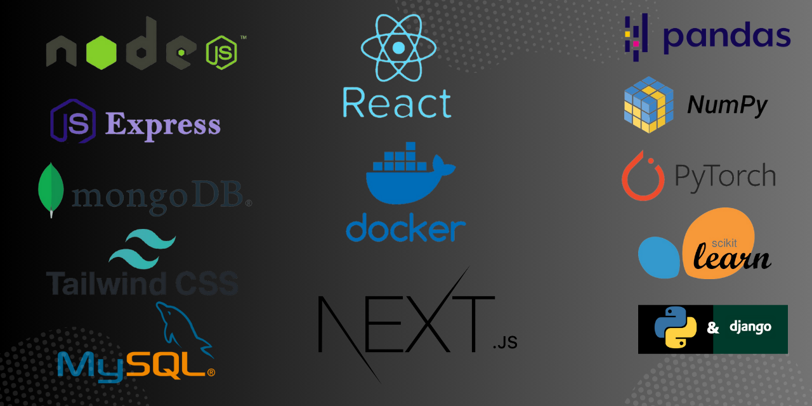

<h1 align="center">Hi 👋, I'm Prohlad Mandal</h1>
<h3 align="center">A passionate Programmer from Bangladesh</h3>

I am fascinated by how computer technology 🌠has brought changes to our lives that could never have been predicted; witnessing the expansion of computer science allowed me to consider studying software engineering from an early age, and my enthusiasm has perpetually developed since this time. And also I love exploring new tech stack 💻 and leveraging them to build cool stuffs 🛠ï¸

 
  
<!--   -->
<!--   -->

  
  
  
  
  
 

 

  
  
  
  
  
  

  

- 🔭 I’m currently working on **Battery Low Ltd**

- 🌱 I’m currently learning **Machine Learning**

- 👨‍💻 All of my projects are available at [prohlad's workspace](https://prohlad-mandal.netlify.app/)

- 💬 Ask me about **Javascript, ExpressJS, NodeJS, ReactJS, NextJS, Tailwind CSS, MongoDB, MySQL, Python, Machine Learning**

- 📫 How to reach me **prohlad.m99@gmail.com**

- 📄 Know about my experiences [my experiences](https://prohlad-mandal.netlify.app/)

- ⚡ Fun fact **I think I'm funny**

 
<h3 align="left">Connect with me:</h3>

 

<h3 align="left">Languages and Tools:</h3>

- Backend

  

- Frontend

  

- Database

  

- Cloud Servers

  

- Tools

  

 

<h3 align="left">Trophy:</h3>

  

 

 

   

<h3 align="left">GitHub Stats:</h3>

 

  

<h3 align="left">Activity:</h3>

  

<!-- <h3 align="left">Achievements:</h3>

    -->

<!--  -->

 <em><b>I love connecting with different people</b> so if you want to say <b>hi, I'll be happy to meet you more!</b> :)</em>

 

 Thank you for visiting my profile 🧡 

